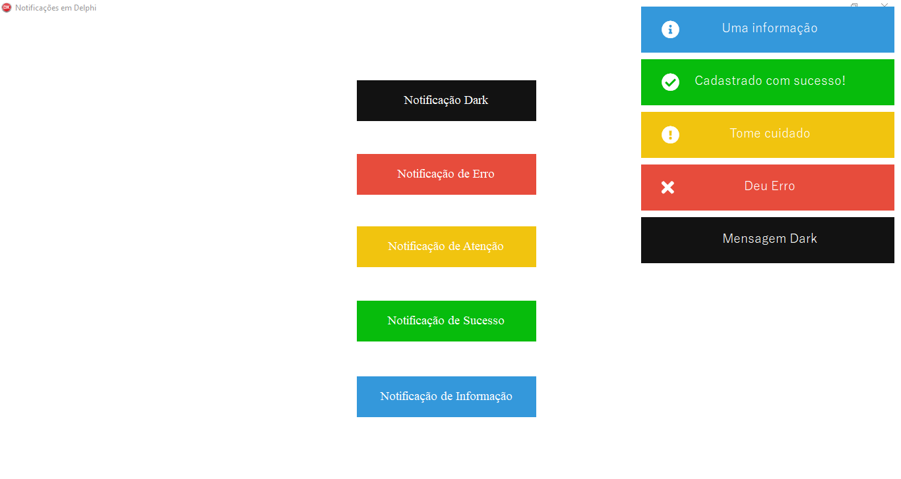

# NotificacoesEmDelphi

### Resolvi criar esse projeto, pois percebi que os sistemas desktops não emitem aqueles balõezinhos como na web em resposta a alguma ação executada, por exemplo: Cadastrado com sucesso, Sem conexão,..., e tudo mais. Se quiser contribuir com esse projeto fique a vontade hehe.

<h3 align="center">
  
</h3>

#### Requisitos:
- Ter baixado o [EventBus](https://github.com/spinettaro/delphi-event-bus) 
- Referenciar o EventBus no seu Delphi

#### Como utilizar:

Importe a unit Notificacoes.Notificacoes.Impl.NotificacaoFactory

Exiba a mensagem que quiser:

``` 
TNotificacaoFactory.New.Dark('Mensagem Dark');
```

``` 
TNotificacaoFactory.New.Informacao('Uma informação');
```

``` 
TNotificacaoFactory.New.Sucesso('Cadastrado com sucesso!');
```

``` 
TNotificacaoFactory.New.Warning('Tome cuidado');
```

``` 
TNotificacaoFactory.New.Erro('Deu Erro');
```

#### Se preferir personalise o seu balão utilizando a classe TNotificacao encadeando os métodos

```
TNotificacao.New.Mensagem(Mensagem).Icone(CODIGO_ICONE).Cor(CODIGO_COR).Exibir;
```

O código do ícone você vai pegar no site [Font Awesome](https://fontawesome.com/)<br/>
A cor é do tipo TColor como: COR_PRETO = $00121212;
